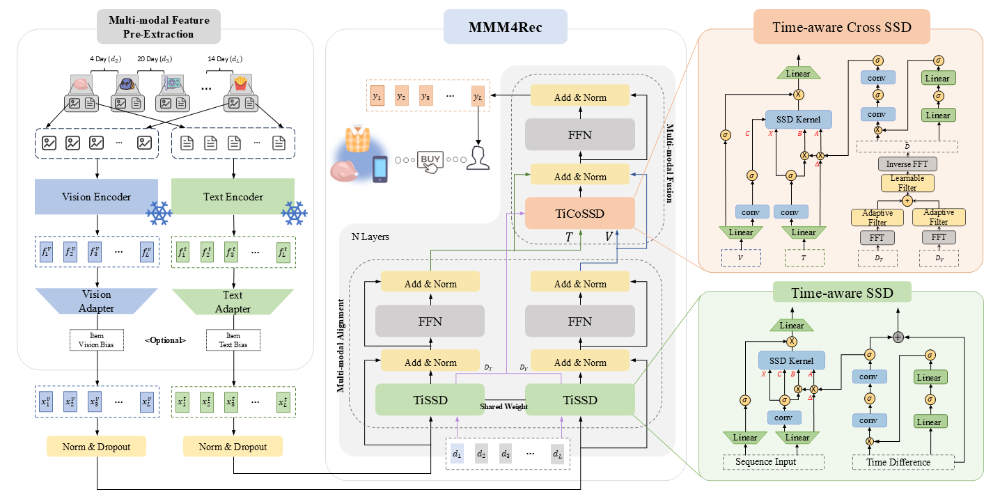

# Towards Transfer-Efficient Multi-modal Sequential Recommendation with State Space Duality

*The code repository has been anonymized*

## 1. Introduction

  <p align="center">
    
  </p>

> **Towards Transfer-Efficient Multi-modal Sequential Recommendation with State Space Duality**

We propose **MMM4Rec**(Multi-Modal Mamba for Sequential Recommendation), a transfer-efficient multimodal sequential recommendation model. By establishing intrinsic algebraic constraints that align with sequential recommendation principles, MMM4Rec eliminates the need for complex optimization objectives required by other multimodal sequential recommendation models. During both pre-training and fine-tuning, MMM4Rec is optimized solely using the standard cross-entropy loss. This unified and simplified optimization objective enables MMM4Rec to achieve rapid convergence when transferred to new domains.

In the following, we will guide you how to use this repository step by step. 🤗

## 2. Preparation
### 2.1 Environment Requirements
The following are the main runtime environment dependencies for running the repository：
- linux (We use Ubuntu 22.0.4)
- cuda 12.1
- python 3.10.15
- pytorch 2.3.1
- numpy 1.26.4
- pandas 2.2.3
- jsonlines 4.0.0
- pytorch-lightning 2.4.0
- lightning 2.4.0
- transformers 4.47.0
- sentencepiece 0.2.0
- tabulate 0.9.0
- tensorboardX 2.6.2
- tensorboard 2.19.0
- casual-conv1d 1.4.0
- mamba-ssm 2.2.2

You can also view detailed environment information in file [environment.yaml](environment.yaml).

### 2.2 DataSets
This study focuses on the [`🛒 Amazon Review 2018`](https://nijianmo.github.io/amazon/index.html) dataset.

You can download our preprocessed dataset directly via the anonymous link [https://figshare.com/s/f7603ea556c23c2aef88](https://figshare.com/s/f7603ea556c23c2aef88) and extract the subfolders (e.g., `Scientific`) from the downloaded archive into the [`📁 dataset/📁 amazon-2018/📁 processed`](dataset/amazon-2018/processed) folder. 

For detailed dataset preprocessing steps and descriptions, please refer to [`📁 dataset/Ⓜ️ READEM.md`](dataset/README.md).

### 2.3 Project Structure
In this section, you can learn about our project structure. 

You can click on the directory below to expand and view the project structure: 
<details><summary>📁 MMM4Rec</summary>
<ul>
    <li>📁 baseline | (The baseline model in the paper) </li>
    <ul>
        <li>📁 BSARec</li>
        <ul>
            <li>📜 config.yaml</li>
            <li>🐍 run.py</li>
        </ul>
        <li>📁 ...</li>
    </ul>
    <li>📁 configs | (Configuration file for MMM4Rec) </li>
    <ul>
        <li>📁 finetune </li>
            <ul>
                <li>📜 config_mmm4rec_scientific.yaml</li>
                <li>📜 ...</li>
            </ul>
        <li>📜 config_mmm4rec_FHCKM.yaml</li>
    </ul>
    <li>📁 data | (Dataset class pytorch implementation) </li>
    <ul>
        <li>🐍 amazon_dataset.py</li>
    </ul>
    <li>📁 dataset | (Store dataset files) </li>
    <ul>
        <li>📁 amazon-2018</li>
        <ul>
            <li>📁 preprocess</li>
            <li>📁 processed</li>
            <li>📁 raw</li>
        </ul>
    </ul>
    <li>📁 misc | (Store readme related images) </li>
    <li>📁 model | (Python implementation of the model) </li>
    <ul>
        <li>📁 encoder | (Kernel Implementation)</li>
        <ul>
            <li>🐍 ssd_kernel.py</li>
            <li>🐍 ...</li>
        </ul>
        <li>🐍 mmm4rec.py</li>
        <li>🐍 ...</li>
    </ul>
    <li>📁 pre_weights | (Pre-trained weight files)</li>
    <ul>
        <li>📀 pretrained_weight.ckpt</li>
    </ul>
    <li>📁 reference_log | (Reference log file)</li>
    <ul>
        <li>📁 scientific</li>
        <ul>
            <li>📁 with_id | (With ID Feature)</li>
            <li>📁 without_id | (Without ID Feature)</li>
        </ul>
        <li>📁 ...</li>
    </ul>
    <li>📁 saved | (Store the training logs and weights)</li>
    <ul>
        <li>📁 MMM4Rec</li>
        <ul>
            <li>📁 {time}</li>
            <ul>
                <li>📄 output.log</li>
                <li>📀 best_epoch.ckpt</li>
            </ul>
            <li>📁 ...</li>
        </ul>
        <li>📁 ...</li>
    </ul>
    <li>📁 script | (Model fine-tuning script)</li>
    <ul>
        <li>📁 finetune</li>
        <ul>
            <li>🚅 scientific.sh</li>
            <li>🚅 ...</li>
        </ul>
    </ul>
    <li>📁 trainer | (Python Implementation of Trainer)</li>
    <ul>
        <li>🐍 pretrain_trainer.py</li>
        <li>🐍 trainer.py</li>
        <li>🐍 utils.py</li>
    </ul>
    <li>📜 environment.yaml</li>
    <li>🐍 callback.py</li>
    <li>🐍 main.py</li>
    <li>🐍 pretrain.py</li>
    <li>🐍 test.py</li>
</ul>
</details>

## 3. Run
Ok, congratulations 🎇, you have finished all the preparation 👍, let's start training the model! 😄 

This section will introduce the training methods of the model. 

### 3.1 Pre-train
After preparing our provided pretraining dataset, you can directly pretrain MMM4Rec using the following approach:
```shell
python pretrained.py
```

### 🚀 3.2 Fine-tune
As described in our paper, our work primarily focuses on model transfer efficiency. To help you quickly verify our results, we have provided pre-trained model weights in the [`📁 pre_weights`](pre_weights) folder, along with a quick-start shell script in [`📁 script`](script) .

To fine-tune **MMM4Rec** in the `Scientific` domain, simply run the following command:

```shell
cd ./script/finetune
/bin/bash scientific.sh
cd ../../
```

You can also directly examine the training logs in the [`📁 reference_log`](reference_log) folder to verify our work's effectiveness. 

For example, check the [output.log](reference_log/scientific/with_id/2025-05-13_18-13-44/output.log) file to see ***MMM4Rec***'s fine-tuning logs in the `Scientific` domain.

## 4. Acknowledgements
Our implementation is built upon [Pytorch](https://github.com/pytorch/pytorch) and [Pytorch Lightning](https://github.com/Lightning-AI/pytorch-lightning) - we gratefully acknowledge their excellent work. 

For dataset processing, we referenced approaches from [MMSRec](https://github.com/kz-song/MMSRec), [UniSRec](https://github.com/RUCAIBox/UniSRec), and [MISSRec](https://github.com/gimpong/MM23-MISSRec). Our trainer implementation draws inspiration from [RecBole](https://github.com/RUCAIBox/RecBole).

Notably, we mathematically implemented an SSD kernel attention form ([`🐍 ssd_kernel.py`](model/encoder/ssd_kernel.py)) equivalent to [Mamba](https://github.com/state-spaces/mamba)'s approach.

Finally, we sincerely thank the anonymous reviewers for their thorough evaluation of this work 🤗.

